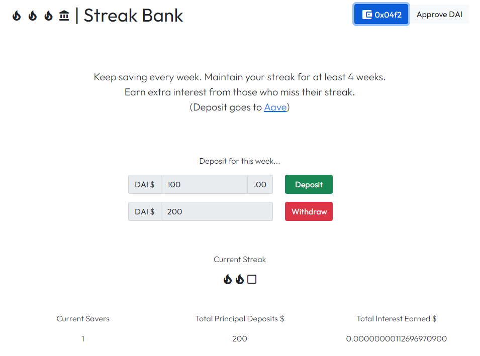

# StreakBank

Keep saving every week. Maintain your streak for at least 4 weeks. Earn extra interest from those who miss their streak.



## Try it Out

Try out the DApp using the UI, or interact with the contract directly on [Kovan Testnet Explorer](https://kovan.etherscan.io/).

- [Test Site using Ethereunm Kovan testnet](https://thomasmktong.github.io/blockchain-developer-bootcamp-final-project/)
- [Deployed Address](./deployed_address.txt)

## Technical Design

The contract is only deployed to Ethereunm Kovan testnet at the moment. However, it is possible to be deployed to other chains / L2 that have Aave or Aave-forks.

Detailed information:
- [Design Pattern Decisions](./design_pattern_decisions.md)
- [Avoiding Common Attacks](./avoiding_common_attacks.md)

## Setup

Install Truffle.
```bash
npm install -g truffle
```

Install Ganache for having a local dev Ethereum network.
```bash
npm install -g ganache ganache-cli
```

Install all the project dependcies
```bash
npm install
```

Compile contracts
```bash
truffle compile
```

Start dev env in one terminal
```bash
truffle develop
```

## Tests

**Requirement:** The tests use the file `deploy.config.js` as input to the contract migration. It is already been configured with the ready-to-deploy settings.

To run the unit tests use either `npm run test` or `truffle test`.

To run test coverage run `npm run coverage` or `truffle run coverage`.

## Contract Deployment
The project uses [Infura](https://infura.io/) to deploy smart contracts to Ethereum networks (testnets and mainnet). What you'll need:
- SignIn/SignUp at Infura, create a project and get the project id.
- Your wallet mnemonic (12 words seed).

**Setup**
1. Copy [.env.sample](./.env.sample) as an `.env` file. You can run this command in your terminal: `cp .env.sample .env`
2. Open file `.env`
3. Insert your Infura ProjectId and your wallet mnemonic in the file.
4. Open the file [deploy.config.js](./deploy.config.js) and review the deployment configs for the contract.
5. Once you have the `.env` and `deploy.config.js` files properly setup, you can deploy the contract to the desired network

**Deploy Contracts**

These are the commands that can be used to deploy (deployment ONLY) the contracts to the appropriate network:
- Deploy to kovan: `npm run deploy:kovan`
- Deploy to ropsten: `npm run deploy:ropsten`
- Deploy to mainnet (PRODUCTION): `npm run deploy:mainnet`
- Deploy to polygon (PRODUCTION): `npm run deploy:polygon`
- Deploy to polygon the whitelisted contract (PRODUCTION): `npm run deploy:polygon-whitelisted`
- Deploy to Celo Alfajores testnet: `npm run deploy:alfajores`
- Deploy to Celo Mainnet: `npm run deploy:celo`

**Verify Contract**

1. Install [Multisol](https://github.com/paulrberg/multisol) and run `npm run multisol` to generate the verifiable Solidity files
2. Make sure to use the appropriate Etherscan version that matches the network where the contract is deployed to (mainnet or testnets)
    1. The address of the deployed contract is available in the deployment log, displayed in the terminal window
3. Access the option to "Verify and Publish" the contract on the block explorer and enter the required parameters as below:
    1. *Contract Address*: Filled-in by Etherscan. Get the address of the deployed contract from the deployment log, displayed in the terminal window
    2. *Compiler Type*: Select the option "Solidity (Multi-Part File)"
    3. *Compiler Version*: Check the version used by the repo on [truffle-config file](./truffle-config.js). Select the same config
    4. *Open Source License*: Choose the license. Use "No licence (None)" if not sure about which one to use
    5. *Optimization*: Check if optimization is used by the repo on [truffle-config file](./truffle-config.js). Select the same config
    6. *Solidity files*: Select and upload all the generated Solidity files (after executing steps 1 and 2 above).
    7. *Constructor Arguments ABI-Encoded*: Filled-in by Etherscan. Copy/Paste the Constructor Arguments ABI-Encoded available in the deployment log, displayed in the terminal window
    8. *Misc Settings*: Make sure the configs available here, specially _Runs (Optimizer)_ is the same as the configs set in the [truffle-config file](./truffle-config.js).